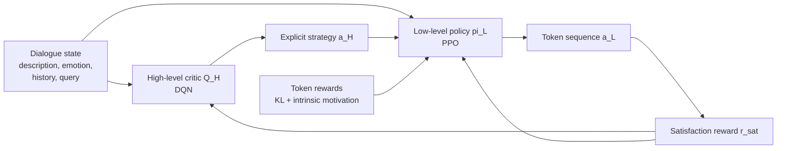

<div align="center">

# ToSCA

### Temporal and Strategic Abstractions of Conversational Agents

**Code for the paper _ToSCA: Leveraging Hierarchical Reinforcement Learning on Temporal and Strategic Abstractions of Conversational Agents_ (EMNLP 2026 Findings)**


An OpenRLHF-based implementation of a two-level conversational agent that first decides **how to respond** and then learns **what to say**.

</div>

---

## Table of Contents

- [Overview](#overview)
- [Method](#method)
- [Implementation](#implementation)
- [Repository Structure](#repository-structure)
- [Installation](#installation)
- [Data Preparation](#data-preparation)
- [Training](#training)
- [Important Arguments](#important-arguments)
- [Paper Settings](#paper-settings)
- [Reported Results](#reported-results)
- [Placeholders](#placeholders)
- [Notes and Limitations](#notes-and-limitations)
- [Acknowledgements](#acknowledgements)

## Overview

Most language-model RL methods make decisions at only one timescale:

- **Token-level RL** can optimize detailed generation, but its action space is enormous and the useful dialogue reward usually arrives only after a complete response.
- **Utterance-level RL** can plan entire dialogue turns, but it may miss the rich token-level learning signal needed to improve the actual response.

ToSCA connects these two views with a hierarchical Markov decision process. At every dialogue turn, a high-level model selects an explicit textual strategy such as `Question`, `Inform`, or `Reflection of Feelings`. A low-level policy then generates the response token by token while being conditioned on that strategy.

The architecture is **Critic<sup>H</sup>-Actor<sup>L</sup>-Critic<sup>L</sup>**:

- `Q_H`: a high-level strategy critic trained with DQN;
- `pi_L`: a low-level response policy trained with PPO;
- `Q_L`: a low-level value critic trained together with `pi_L`.



The explicit strategy is the key abstraction: it reduces high-level exploration to a small, interpretable discrete action space while still allowing the low-level model to produce unrestricted natural-language responses.

## Method

### 1. Two-level state and action spaces

| Level | State | Action | Reward | Solver |
|---|---|---|---|---|
| High level | Current query, dialogue history, user emotion, session description | One dialogue strategy | Utterance satisfaction `r_sat` | DQN |
| Low level | High-level state, selected strategy, partially generated response | Next response token | Satisfaction + KL + intrinsic reward | PPO |

The high-level action persists for one whole assistant utterance. The low-level policy executes that action by generating all tokens in the response.

### 2. High-level strategic critic

The high-level prompt is written as a multiple-choice question. If the strategy set contains `K` options, the action space is represented by textual action tokens such as `(1), ..., (K)`.

Instead of adding a separate scalar value head, ToSCA treats the language model itself as the Q-function. For an action containing `N` tokens, this implementation uses the mean score of those action tokens:

```text
Q_H(s, a) = mean_i LM_score(action_token_i | I_H(s), action_token_<i)
```

The paper defines `LM_score` as the **averaged logits**. Therefore, the default is:

```bash
--q_value_mode logit
```

`logprob` and `prob` are also available for controlled comparisons, but they are not the paper-default interpretation.

The online network is optimized with a DQN Bellman target:

```text
y_t = r_sat_t + (1 - done_t) * gamma * max_a Q_H_target(s_{t+1}, a)
L_QH = MSE(Q_H(s_t, a_t), y_t)
```

The target network is synchronized periodically. Multi-token action strings and DeepSpeed ZeRO-3 parameter gathering are supported.

At inference time, strategy selection is deterministic:

```text
a_H = argmax_a Q_H(s, a)
```

### 3. Low-level actor-critic

The selected strategy is inserted into the low-level prompt together with the dialogue context. The actor then samples a response token by token, while the critic estimates token-level values for generalized advantage estimation.

The actor and critic follow the PPO training loop from OpenRLHF 0.3.8, including clipped policy updates, clipped value updates, a reference policy, replay-buffered experiences, optional EMA, gradient accumulation, and DeepSpeed integration.

### 4. Dual-granularity reward

ToSCA uses one utterance-level reward and two token-level auxiliary signals:

```text
r_H_t = r_sat_t
r_L_k = r_sat_t + beta_1 * r_KL_k + beta_2 * r_im_k
```

where:

- `r_sat` is the user-satisfaction score. The paper obtains a score from `0` to `5` with an oracle LLM.
- `r_KL` penalizes deviation from the reference policy.
- `r_im = -log pi_L(a_k | s_L, a_H)` is the paper's intrinsic-motivation term.

This repository maps `beta_1` to `--init_kl_coef` and `beta_2` to `--intrinsic_reward_coef`. By default, the utterance satisfaction is broadcast to valid response-token positions, matching the paper's dense token-level formulation. Use `--disable_dense_satisfaction_reward` to recover OpenRLHF's terminal-only reward behavior.

### 5. Training flow

The paper's rollout alternates between the two timescales:

1. Read the current dialogue state.
2. Select a strategy with `argmax Q_H`.
3. Generate a response with `pi_L`, conditioned on the strategy.
4. Obtain `r_sat` from an oracle or reward model.
5. Store an utterance-level transition for DQN.
6. Store token-level experiences for PPO.
7. Update `Q_H`, `pi_L`, and `Q_L` with their corresponding objectives.

The command-line implementation exposes the high-level and low-level optimization stages separately. This makes it possible to use offline transition data, a local reward model, or an external rollout system without hard-coding a proprietary API.

## Implementation

This repository is adapted from **OpenRLHF 0.3.8** and implements the paper-specific components below.

| Paper component | Implementation |
|---|---|
| High-level and low-level prompts | [`utils/tosca.py`](utils/tosca.py) |
| DailyDialog and ESConv strategy spaces | [`utils/tosca.py`](utils/tosca.py) |
| High-level transition parsing | [`datasets/tosca_dataset.py`](datasets/tosca_dataset.py) |
| Low-level strategy-conditioned prompts | [`datasets/tosca_dataset.py`](datasets/tosca_dataset.py) |
| High-level DQN and target network | [`trainer/q_stra_trainer.py`](trainer/q_stra_trainer.py) |
| Low-level PPO loop | [`trainer/ppo_trainer.py`](trainer/ppo_trainer.py) |
| KL, dense satisfaction, and intrinsic reward | [`models/utils.py`](models/utils.py) |
| PPO experience construction | [`trainer/ppo_utils/experience_maker.py`](trainer/ppo_utils/experience_maker.py) |
| High-level training entry point | [`cli/train_straQ.py`](cli/train_straQ.py) |
| Low-level training entry point | [`cli/train_ppo.py`](cli/train_ppo.py) |

## Repository Structure

The source tree is intentionally flat so that the method-specific components are visible directly from the repository root. During installation, these folders are exposed under the logical Python package `openrlhf.*` for compatibility with OpenRLHF tooling.

```text
ToSCA/
|-- cli/
|   |-- train_straQ.py             # High-level strategy DQN
|   `-- train_ppo.py               # Low-level token PPO
|-- datasets/
|   |-- tosca_dataset.py           # ToSCA transition and prompt datasets
|   `-- ...                        # OpenRLHF-compatible dataset helpers
|-- models/
|   |-- actor.py                   # Causal-LM actor wrapper
|   |-- model.py                   # Reward/value model wrapper
|   `-- utils.py                   # ToSCA reward composition
|-- trainer/
|   |-- q_stra_trainer.py          # DQN Bellman updates for Q_H
|   |-- ppo_trainer.py             # PPO actor-critic updates
|   `-- ppo_utils/                 # Experiences, KL control, replay buffer
|-- utils/
|   |-- tosca.py                   # Prompts, actions, and strategy definitions
|   `-- ...                        # DeepSpeed and data utilities
|-- requirements.txt
|-- pyproject.toml
`-- version.txt
```

## Installation

### Requirements

- Python `3.10+`
- CUDA-capable PyTorch environment
- GPU(s) with bfloat16 support recommended
- DeepSpeed `0.14.4`
- OpenRLHF-compatible model, critic, and reward-model checkpoints

### Install from source

```bash
git clone https://github.com/AaronJi/ToSCA.git
cd ToSCA
pip install -e .
```

The editable installation is required because the repository uses a flat source layout while preserving the `openrlhf.*` module namespace.

`flash-attn` is hardware- and CUDA-version-sensitive. If the pinned package does not match the local PyTorch/CUDA build, install a compatible wheel separately or remove it from `requirements.txt` and run without `--flash_attn`.

## Data Preparation

Data may be supplied as a Hugging Face dataset name or a local file/dataset path accepted by `datasets.load_dataset`. All machine-specific values are passed through command-line arguments.

### Strategy spaces

DailyDialog uses four dialogue acts:

| Index | Strategy |
|---:|---|
| 1 | Inform |
| 2 | Question |
| 3 | Directives |
| 4 | Commissive |

ESConv uses eight support strategies:

| Index | Strategy |
|---:|---|
| 1 | Question |
| 2 | Restatement or Paraphrasing |
| 3 | Reflection of Feelings |
| 4 | Self-disclosure |
| 5 | Affirmation and Reassurance |
| 6 | Providing Suggestions |
| 7 | Information |
| 8 | Others |

Use `--is_dailydialogue` for the four-strategy default. Without it, the ESConv strategy set is used. Custom strategy names and action strings can be provided with `--strategies` and `--strategy_tokens`.

### High-level DQN data

Each record represents an utterance-level transition `(s_t, a_t, r_t, s_{t+1}, done_t)`:

```json
{
  "desc": "<SESSION_DESCRIPTION>",
  "emo": "<USER_EMOTION>",
  "history": "<DIALOGUE_HISTORY_BEFORE_QUERY>",
  "query": "<CURRENT_USER_QUERY>",
  "strategy": "<STRATEGY_NAME_OR_INDEX>",
  "reward": 5.0,
  "next_desc": "<NEXT_SESSION_DESCRIPTION>",
  "next_emo": "<NEXT_USER_EMOTION>",
  "next_history": "<NEXT_DIALOGUE_HISTORY>",
  "next_query": "<NEXT_USER_QUERY>",
  "done": false
}
```

Accepted strategy values include a zero-based index, a one-based index, an action string such as `(2)`, or an exact strategy name.

If prompts are already rendered, provide them directly:

```json
{
  "current_prompt": "<CURRENT_HIGH_LEVEL_PROMPT>",
  "next_prompt": "<NEXT_HIGH_LEVEL_PROMPT>",
  "strategy": "<ACTION>",
  "reward": 4.0,
  "done": false
}
```

Use the corresponding key arguments when the field names differ:

```text
--current_input_key <CURRENT_PROMPT_FIELD>
--next_input_key <NEXT_PROMPT_FIELD>
--strategy_key <STRATEGY_FIELD>
--reward_key <SATISFACTION_REWARD_FIELD>
--done_key <TERMINAL_FIELD>
```

### Low-level PPO data

When `--apply_tosca_prompt` is enabled, each prompt record must contain the current dialogue context and a selected strategy:

```json
{
  "desc": "<SESSION_DESCRIPTION>",
  "emo": "<USER_EMOTION>",
  "history": "<DIALOGUE_HISTORY_BEFORE_QUERY>",
  "query": "<CURRENT_USER_QUERY>",
  "strategy": "<SELECTED_STRATEGY>"
}
```

The strategy may come from gold annotations, a frozen high-level checkpoint, or an external rollout pipeline. If the dataset already contains final prompts, omit `--apply_tosca_prompt` and select the prompt field with `--input_key`.

## Training

### 1. Train the high-level strategy critic

The following command follows the paper's main DQN settings. Add `--is_dailydialogue` for DailyDialog.

```bash
deepspeed --module openrlhf.cli.train_straQ \
  --pretrain <HIGH_LEVEL_BASE_MODEL_OR_CHECKPOINT> \
  --dataset <HIGH_LEVEL_TRANSITION_DATASET_OR_FILE> \
  --train_split <TRAIN_SPLIT> \
  --eval_split <EVAL_SPLIT> \
  --save_path <HIGH_LEVEL_Q_OUTPUT_DIR> \
  --ckpt_path <HIGH_LEVEL_Q_DEEPSPEED_CKPT_DIR> \
  --strategy_key <STRATEGY_FIELD> \
  --reward_key <SATISFACTION_REWARD_FIELD> \
  --done_key <TERMINAL_FIELD> \
  --q_value_mode logit \
  --max_len 1024 \
  --learning_rate 5e-6 \
  --train_batch_size 64 \
  --gamma 0.85 \
  --target_update_steps 10 \
  --zero_stage 3 \
  --bf16 \
  --gradient_checkpointing
```

For a custom strategy space:

```bash
--strategies "<STRATEGY_1>,<STRATEGY_2>,<STRATEGY_3>" \
--strategy_tokens "(1),(2),(3)"
```

### 2. Train the low-level actor and critic

```bash
deepspeed --module openrlhf.cli.train_ppo \
  --pretrain <LOW_LEVEL_ACTOR_BASE_MODEL_OR_CHECKPOINT> \
  --critic_pretrain <LOW_LEVEL_CRITIC_BASE_MODEL_OR_CHECKPOINT> \
  --reward_pretrain <REWARD_MODEL_CHECKPOINT> \
  --prompt_data <LOW_LEVEL_PROMPT_DATASET_OR_FILE> \
  --prompt_split <TRAIN_SPLIT> \
  --apply_tosca_prompt \
  --strategy_key <SELECTED_STRATEGY_FIELD> \
  --save_path <LOW_LEVEL_ACTOR_OUTPUT_DIR> \
  --ckpt_path <LOW_LEVEL_PPO_DEEPSPEED_CKPT_DIR> \
  --prompt_max_len 1024 \
  --generate_max_len 128 \
  --actor_learning_rate 9e-7 \
  --critic_learning_rate 9e-4 \
  --train_batch_size 64 \
  --rollout_batch_size 64 \
  --init_kl_coef 0.01 \
  --intrinsic_reward_coef 0.01 \
  --gamma 1.0 \
  --top_p 0.9 \
  --top_k 10 \
  --temperature 0.7 \
  --zero_stage 3 \
  --bf16 \
  --gradient_checkpointing
```

For ESConv, change both prompt/window limits from `1024` to `2048` to match the paper configuration.

## Important Arguments

### High level

| Argument | Default | Meaning |
|---|---:|---|
| `--q_value_mode` | `logit` | Strategy action score: `logit`, `logprob`, or `prob` |
| `--gamma` | `0.85` | DQN discount factor |
| `--target_update_steps` | `10` | Online-to-target synchronization interval |
| `--strategies` | dataset default | Comma-separated strategy names |
| `--strategy_tokens` | `(1),...,(K)` | Comma-separated textual action strings |
| `--learn_from_org` | off | Replace observed reward with `1` for legacy behavior |

### Low level

| Argument | Default | Meaning |
|---|---:|---|
| `--intrinsic_reward_coef` | `0.01` | `beta_2`, weight of intrinsic motivation |
| `--init_kl_coef` | `0.01` | Initial KL coefficient, corresponding to `beta_1` |
| `--disable_dense_satisfaction_reward` | off | Use terminal-only satisfaction instead of dense reward |
| `--apply_tosca_prompt` | off | Render the strategy-conditioned paper prompt |
| `--strategy_key` | `strategy` | Field containing the selected high-level strategy |

## Paper Settings

| Parameter | DailyDialog | ESConv |
|---|---:|---:|
| High-level learning rate | `5e-6` | `5e-6` |
| High-level batch size | `64` | `64` |
| High-level max window | `1024` | `2048` |
| Target update frequency | `10` | `10` |
| High-level `gamma` | `0.85` | `0.85` |
| Actor learning rate | `9e-7` | `9e-7` |
| Critic learning rate | `9e-4` | `9e-4` |
| Low-level batch size | `64` | `64` |
| Low-level max window | `1024` | `2048` |
| Max generation length | `128` | `128` |
| `beta_1` / KL coefficient | `0.01` | `0.01` |
| `beta_2` / intrinsic coefficient | `0.01` | `0.01` |
| Low-level `gamma` | `1.0` | `1.0` |
| Precision | `bf16` | `bf16` |
| DeepSpeed | ZeRO-3 | ZeRO-3 |

The paper reports decoding with `top_p=0.9`, `top_k=10`, and `temperature=0.7`.

## Reported Results

The following values are reported in the paper and are included for reference. They are not automatically reproduced by installing this repository; exact reproduction also depends on the model checkpoints, rollout environment, oracle scoring, data preprocessing, and hardware setup.

| Dataset | Acc | Macro-F1 | BLEU-2 | ROUGE-L | Distinct-2 |
|---|---:|---:|---:|---:|---:|
| DailyDialog | **63.64** | **58.91** | **16.35** | **35.22** | **62.67** |
| ESConv | **39.26** | **36.85** | **6.93** | **16.28** | 52.42 |

On the zero-shot EmpatheticDialogues test, the paper reports `BLEU-2=4.49`, `ROUGE-L=12.93`, and `Distinct-2=46.53`. Ablations show that removing either hierarchy level causes a clear quality drop, while removing intrinsic motivation reduces strategy accuracy and response metrics.

## Placeholders

Before training, replace every placeholder used in the commands with a real value from the local environment:

```text
<HIGH_LEVEL_BASE_MODEL_OR_CHECKPOINT>
<HIGH_LEVEL_TRANSITION_DATASET_OR_FILE>
<HIGH_LEVEL_Q_OUTPUT_DIR>
<HIGH_LEVEL_Q_DEEPSPEED_CKPT_DIR>
<LOW_LEVEL_ACTOR_BASE_MODEL_OR_CHECKPOINT>
<LOW_LEVEL_CRITIC_BASE_MODEL_OR_CHECKPOINT>
<REWARD_MODEL_CHECKPOINT>
<LOW_LEVEL_PROMPT_DATASET_OR_FILE>
<LOW_LEVEL_ACTOR_OUTPUT_DIR>
<LOW_LEVEL_PPO_DEEPSPEED_CKPT_DIR>
<TRAIN_SPLIT>
<EVAL_SPLIT>
<STRATEGY_FIELD>
<SELECTED_STRATEGY_FIELD>
<SATISFACTION_REWARD_FIELD>
<TERMINAL_FIELD>
```

No personal filesystem path, model location, API key, or output directory is hard-coded in the repository.

## Notes and Limitations

- The paper uses an oracle LLM to produce satisfaction scores. This repository deliberately does not embed credentials or a provider-specific API call. Supply rewards in high-level transition data and a compatible reward-model checkpoint for PPO, or connect an external rollout/oracle service.
- The high-level and low-level commands are separate training entry points. A fully online interleaved run requires an external coordinator that alternates strategy selection, response generation, oracle evaluation, and buffer construction as described in Algorithm 1.
- Hierarchical RL is sensitive to reward scale, target-network updates, batch composition, and model initialization. Start from the paper settings, then tune for the chosen backbone and hardware.
- `flash-attn`, 4-bit loading, LoRA, and ZeRO-3 support depend on compatible CUDA, PyTorch, Transformers, and DeepSpeed versions.
- The repository contains training code but does not distribute model checkpoints, datasets, or oracle outputs.

## Acknowledgements

This implementation builds on [OpenRLHF](https://github.com/OpenRLHF/OpenRLHF) `v0.3.8` and its DeepSpeed-based PPO training stack.

Please cite the final published paper metadata once it is available. The title is:

```text
ToSCA: Leveraging Hierarchical Reinforcement Learning on Temporal and Strategic
Abstractions of Conversational Agents
```
