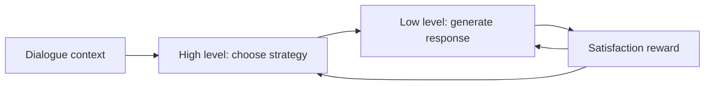

<div align="center">

# ToSCA

**Temporal and Strategic Abstractions of Conversational Agents**

Code for the paper **_ToSCA: Leveraging Hierarchical Reinforcement Learning on Temporal and Strategic Abstractions of Conversational Agents_**<br>
EMNLP 2026 Findings


**Choose a strategy. Generate a response. Optimize both.**

[How It Works](#how-it-works) | [Quick Start](#quick-start) | [Data](#data) | [Training](#training) | [Results](#reported-results)

</div>

---

## How It Works

ToSCA splits every assistant turn into two decisions:

1. A **high-level model** reads the dialogue and chooses an explicit strategy, such as `Question`, `Inform`, or `Reflection of Feelings`.
2. A **low-level model** follows that strategy and writes the response token by token.

The high level is trained with **DQN** because the strategy space is small and discrete. The low level is trained with **PPO** because response generation still has a large token action space. A satisfaction reward connects the two levels.

| Level | Decides | Runs | Learns with | Reward |
|---|---|---:|---|---|
| High-level `Q_H` | Which strategy to use | Once per response | DQN | Satisfaction |
| Low-level `pi_L`, `Q_L` | Which token to generate | Once per token | PPO | Satisfaction + KL + intrinsic reward |



> The central idea is simple: reduce difficult token-level exploration by planning with a small set of readable dialogue strategies first.

The complete objectives are collected later in [Method Details](#method-details).

## What Is Included

This implementation is based on **OpenRLHF 0.3.8**.

| Component | What this repository adds | Source |
|---|---|---|
| Prompting | Paper-style high-level, low-level, and evaluation prompts | [`utils/tosca.py`](utils/tosca.py) |
| Strategy spaces | DailyDialog and ESConv defaults, plus custom strategies | [`utils/tosca.py`](utils/tosca.py) |
| High-level data | Dialogue transition parsing and action-token handling | [`datasets/tosca_dataset.py`](datasets/tosca_dataset.py) |
| High-level RL | DQN targets, target-network sync, multi-token actions, ZeRO-3 support | [`trainer/q_stra_trainer.py`](trainer/q_stra_trainer.py) |
| Low-level data | Strategy-conditioned PPO prompt rendering | [`datasets/tosca_dataset.py`](datasets/tosca_dataset.py) |
| Low-level RL | OpenRLHF PPO with ToSCA reward composition | [`trainer/ppo_trainer.py`](trainer/ppo_trainer.py) |
| Rewards | Dense satisfaction, KL penalty, and intrinsic motivation | [`models/utils.py`](models/utils.py) |


## Quick Start

### 1. Install

Recommended environment:

| Requirement | Recommended value |
|---|---|
| Python | `3.10+` |
| PyTorch | CUDA build with bfloat16 support |
| DeepSpeed | `0.14.4` |
| Transformers | `4.43.1` |
| Training stack | Model, critic, and reward-model checkpoints |

```bash
git clone https://github.com/AaronJi/ToSCA.git
cd ToSCA
pip install -e .
```

The editable install preserves the `openrlhf.*` Python namespace while keeping the repository folders visible at the top level.

> [!NOTE]
> `flash-attn` must match the local CUDA and PyTorch versions. Install a compatible wheel separately, or run without `--flash_attn`.

### 2. Prepare data

| Training stage | Required data |
|---|---|
| High-level DQN | `(state, strategy, satisfaction, next_state, done)` transitions |
| Low-level PPO | Dialogue context with a selected strategy |

Data can be a Hugging Face dataset name or a local path accepted by `datasets.load_dataset`.

### 3. Train both levels

```text
High-level transitions -> train_straQ -> strategy critic checkpoint
Low-level prompts      -> train_ppo   -> response policy checkpoint
```

Complete commands are provided in [Training](#training).

## Data

### Strategy Spaces

| Dataset | Strategies |
|---|---|
| DailyDialog | Inform, Question, Directives, Commissive |
| ESConv | Question, Restatement or Paraphrasing, Reflection of Feelings, Self-disclosure, Affirmation and Reassurance, Providing Suggestions, Information, Others |

Use `--is_dailydialogue` for the four-strategy DailyDialog setup. Without it, the eight-strategy ESConv setup is used. Custom values are accepted through `--strategies` and `--strategy_tokens`.

<details>
<summary><b>High-level DQN transition format</b></summary>

Each record represents one utterance-level transition:

```json
{
  "desc": "<SESSION_DESCRIPTION>",
  "emo": "<USER_EMOTION>",
  "history": "<DIALOGUE_HISTORY_BEFORE_QUERY>",
  "query": "<CURRENT_USER_QUERY>",
  "strategy": "<STRATEGY_NAME_OR_INDEX>",
  "reward": 5.0,
  "next_desc": "<NEXT_SESSION_DESCRIPTION>",
  "next_emo": "<NEXT_USER_EMOTION>",
  "next_history": "<NEXT_DIALOGUE_HISTORY>",
  "next_query": "<NEXT_USER_QUERY>",
  "done": false
}
```

Strategy values may be zero-based indices, one-based indices, action strings such as `(2)`, or exact strategy names.

Ready-made prompts are also supported:

```json
{
  "current_prompt": "<CURRENT_HIGH_LEVEL_PROMPT>",
  "next_prompt": "<NEXT_HIGH_LEVEL_PROMPT>",
  "strategy": "<ACTION>",
  "reward": 4.0,
  "done": false
}
```

Map custom field names with:

```text
--current_input_key <CURRENT_PROMPT_FIELD>
--next_input_key <NEXT_PROMPT_FIELD>
--strategy_key <STRATEGY_FIELD>
--reward_key <SATISFACTION_REWARD_FIELD>
--done_key <TERMINAL_FIELD>
```

</details>

<details>
<summary><b>Low-level PPO prompt format</b></summary>

When `--apply_tosca_prompt` is enabled, each record contains the dialogue state and selected strategy:

```json
{
  "desc": "<SESSION_DESCRIPTION>",
  "emo": "<USER_EMOTION>",
  "history": "<DIALOGUE_HISTORY_BEFORE_QUERY>",
  "query": "<CURRENT_USER_QUERY>",
  "strategy": "<SELECTED_STRATEGY>"
}
```

The strategy may come from annotations, a frozen high-level checkpoint, or an external rollout pipeline. For data that already contains complete prompts, omit `--apply_tosca_prompt` and select the field with `--input_key`.

</details>

## Training

### High-Level Strategy Critic

This command follows the paper's main DQN recipe:

```bash
deepspeed --module openrlhf.cli.train_straQ \
  --pretrain <HIGH_LEVEL_BASE_MODEL_OR_CHECKPOINT> \
  --dataset <HIGH_LEVEL_TRANSITION_DATASET_OR_FILE> \
  --train_split <TRAIN_SPLIT> \
  --eval_split <EVAL_SPLIT> \
  --save_path <HIGH_LEVEL_Q_OUTPUT_DIR> \
  --ckpt_path <HIGH_LEVEL_Q_DEEPSPEED_CKPT_DIR> \
  --strategy_key <STRATEGY_FIELD> \
  --reward_key <SATISFACTION_REWARD_FIELD> \
  --done_key <TERMINAL_FIELD> \
  --q_value_mode logit \
  --max_len 1024 \
  --learning_rate 5e-6 \
  --train_batch_size 64 \
  --gamma 0.85 \
  --target_update_steps 10 \
  --zero_stage 3 \
  --bf16 \
  --gradient_checkpointing
```

> [!TIP]
> Add `--is_dailydialogue` for DailyDialog. For a custom strategy space, pass matching comma-separated values through `--strategies` and `--strategy_tokens`.

### Low-Level Actor-Critic

```bash
deepspeed --module openrlhf.cli.train_ppo \
  --pretrain <LOW_LEVEL_ACTOR_BASE_MODEL_OR_CHECKPOINT> \
  --critic_pretrain <LOW_LEVEL_CRITIC_BASE_MODEL_OR_CHECKPOINT> \
  --reward_pretrain <REWARD_MODEL_CHECKPOINT> \
  --prompt_data <LOW_LEVEL_PROMPT_DATASET_OR_FILE> \
  --prompt_split <TRAIN_SPLIT> \
  --apply_tosca_prompt \
  --strategy_key <SELECTED_STRATEGY_FIELD> \
  --save_path <LOW_LEVEL_ACTOR_OUTPUT_DIR> \
  --ckpt_path <LOW_LEVEL_PPO_DEEPSPEED_CKPT_DIR> \
  --prompt_max_len 1024 \
  --generate_max_len 128 \
  --actor_learning_rate 9e-7 \
  --critic_learning_rate 9e-4 \
  --train_batch_size 64 \
  --rollout_batch_size 64 \
  --init_kl_coef 0.01 \
  --intrinsic_reward_coef 0.01 \
  --gamma 1.0 \
  --top_p 0.9 \
  --top_k 10 \
  --temperature 0.7 \
  --zero_stage 3 \
  --bf16 \
  --gradient_checkpointing
```

> [!TIP]
> For ESConv, use a `2048` prompt/window length instead of `1024` to match the paper setup.

## Method Details

### High-Level Strategy Value

The high-level prompt is a multiple-choice question over `K` strategies. No extra scalar value head is added. The average language-model logit of the action tokens is used as the strategy value:

$$
Q_{\phi}^{H}(s,a)
= \frac{1}{|a|}\sum_{i=1}^{|a|}
\mathrm{logit}_{\phi}\left(a_i \mid I^{H}(s) \oplus a_{1:i-1}\right).
$$

The implementation therefore defaults to `--q_value_mode logit`. The optional `logprob` and `prob` modes are intended for controlled comparisons.

The online network follows the DQN Bellman target:

$$
\begin{aligned}
y_t
  &= r_t^{\mathrm{sat}}
     + (1-d_t)\gamma\max_{a'}Q_{\bar{\phi}}^{H}(s_{t+1},a'), \\
\mathcal{L}_{Q^{H}}(\phi)
  &= \mathrm{MSE}\left(Q_{\phi}^{H}(s_t,a_t), y_t\right).
\end{aligned}
$$

At inference time, the strategy with the largest value is selected:

$$
a_t^{H}=\mathrm{arg\,max}_{a\in\mathcal{A}^{H}}\;Q_{\phi}^{H}(s_t,a).
$$

### Low-Level Reward

The low-level PPO policy is conditioned on the selected strategy. Its reward combines utterance-level satisfaction with two token-level signals:

$$
\begin{aligned}
r_t^{H} &= r_t^{\mathrm{sat}}, \\
r_k^{L} &= r_t^{\mathrm{sat}}
           + \beta_1 r_k^{\mathrm{KL}}
           + \beta_2 r_k^{\mathrm{im}}.
\end{aligned}
$$

- $r_t^{\mathrm{sat}}$ is the oracle or reward-model satisfaction score.
- $r_k^{\mathrm{KL}}$ keeps the policy close to the reference model.
- $r_k^{\mathrm{im}}=-\log\pi_{\theta}^{L}(a_k^{L}\mid s_k^{L},a_t^{H})$ is the intrinsic-motivation term.

## Configuration

### Key Arguments

| Stage | Argument | Default | Purpose |
|---|---|---:|---|
| High | `--q_value_mode` | `logit` | Score strategy actions with logits, log-probabilities, or probabilities |
| High | `--gamma` | `0.85` | DQN discount factor |
| High | `--target_update_steps` | `10` | Target-network synchronization interval |
| High | `--strategies` | dataset default | Comma-separated strategy names |
| Low | `--init_kl_coef` | `0.01` | KL reward coefficient, corresponding to `beta_1` |
| Low | `--intrinsic_reward_coef` | `0.01` | Intrinsic reward coefficient, corresponding to `beta_2` |
| Low | `--apply_tosca_prompt` | off | Render the strategy-conditioned prompt |
| Low | `--disable_dense_satisfaction_reward` | off | Use terminal-only satisfaction reward |

### Paper Recipe

| Parameter | DailyDialog | ESConv |
|---|---:|---:|
| High-level learning rate | `5e-6` | `5e-6` |
| High-level batch size | `64` | `64` |
| High-level max window | `1024` | `2048` |
| Target update frequency | `10` | `10` |
| High-level `gamma` | `0.85` | `0.85` |
| Actor learning rate | `9e-7` | `9e-7` |
| Critic learning rate | `9e-4` | `9e-4` |
| Low-level batch size | `64` | `64` |
| Low-level max window | `1024` | `2048` |
| Max generation length | `128` | `128` |
| `beta_1` / KL coefficient | `0.01` | `0.01` |
| `beta_2` / intrinsic coefficient | `0.01` | `0.01` |
| Low-level `gamma` | `1.0` | `1.0` |
| Precision / distribution | `bf16` / ZeRO-3 | `bf16` / ZeRO-3 |

The paper uses `top_p=0.9`, `top_k=10`, and `temperature=0.7` for generation.

## Reported Results

Results reported in the paper:

| Dataset | Accuracy | Macro-F1 | BLEU-2 | ROUGE-L | Distinct-2 |
|---|---:|---:|---:|---:|---:|
| DailyDialog | **63.64** | **58.91** | **16.35** | **35.22** | **62.67** |
| ESConv | **39.26** | **36.85** | **6.93** | **16.28** | 52.42 |

| Zero-shot dataset | BLEU-2 | ROUGE-L | Distinct-2 |
|---|---:|---:|---:|
| EmpatheticDialogues | **4.49** | **12.93** | **46.53** |

> [!NOTE]
> Exact reproduction also depends on model checkpoints, preprocessing, rollout behavior, oracle scoring, random seeds, and hardware. Installing this repository alone does not reproduce the reported values.

## Project Layout

The source tree is flat for easier browsing. Installation maps it back to the logical `openrlhf.*` namespace expected by the training commands.

<details>
<summary><b>Show repository tree</b></summary>

```text
ToSCA/
|-- cli/
|   |-- train_straQ.py             # High-level strategy DQN
|   `-- train_ppo.py               # Low-level token PPO
|-- datasets/
|   |-- tosca_dataset.py           # ToSCA transition and prompt datasets
|   `-- ...                        # OpenRLHF dataset helpers
|-- models/
|   |-- actor.py                   # Causal-LM actor wrapper
|   |-- model.py                   # Reward/value model wrapper
|   `-- utils.py                   # Reward composition
|-- trainer/
|   |-- q_stra_trainer.py          # High-level DQN updates
|   |-- ppo_trainer.py             # Low-level PPO updates
|   `-- ppo_utils/                 # Experiences, KL control, replay buffer
|-- utils/
|   |-- tosca.py                   # Prompts and strategy definitions
|   `-- ...                        # DeepSpeed and data utilities
|-- requirements.txt
|-- pyproject.toml
`-- version.txt
```

</details>

## Before You Run

> [!IMPORTANT]
> Replace the placeholders below with values from your own environment. No personal filesystem path, API key, model location, or output directory is hard-coded in this repository.

| Category | Placeholders |
|---|---|
| Models | `<HIGH_LEVEL_BASE_MODEL_OR_CHECKPOINT>`, `<LOW_LEVEL_ACTOR_BASE_MODEL_OR_CHECKPOINT>`, `<LOW_LEVEL_CRITIC_BASE_MODEL_OR_CHECKPOINT>`, `<REWARD_MODEL_CHECKPOINT>` |
| Data | `<HIGH_LEVEL_TRANSITION_DATASET_OR_FILE>`, `<LOW_LEVEL_PROMPT_DATASET_OR_FILE>`, `<TRAIN_SPLIT>`, `<EVAL_SPLIT>` |
| Outputs | `<HIGH_LEVEL_Q_OUTPUT_DIR>`, `<HIGH_LEVEL_Q_DEEPSPEED_CKPT_DIR>`, `<LOW_LEVEL_ACTOR_OUTPUT_DIR>`, `<LOW_LEVEL_PPO_DEEPSPEED_CKPT_DIR>` |
| Fields | `<STRATEGY_FIELD>`, `<SELECTED_STRATEGY_FIELD>`, `<SATISFACTION_REWARD_FIELD>`, `<TERMINAL_FIELD>` |

## Notes

> [!WARNING]
> The paper uses an oracle LLM to produce satisfaction scores. This repository does not embed credentials or provider-specific API calls. Supply rewards in high-level transitions and a compatible reward model for PPO, or connect an external oracle service.

- Hierarchical RL can be sensitive to reward scale, target updates, batch composition, and initialization. Start from the paper recipe and tune for the selected backbone.
- FlashAttention, LoRA, 4-bit loading, and ZeRO-3 require mutually compatible CUDA, PyTorch, Transformers, and DeepSpeed versions.
- Model checkpoints, datasets, and oracle outputs are not distributed in this repository.

## Acknowledgements

This implementation builds on [OpenRLHF](https://github.com/OpenRLHF/OpenRLHF) `v0.3.8` and its DeepSpeed-based PPO stack.

Please cite the final published paper metadata once available:

```text
ToSCA: Leveraging Hierarchical Reinforcement Learning on Temporal and Strategic
Abstractions of Conversational Agents
```
